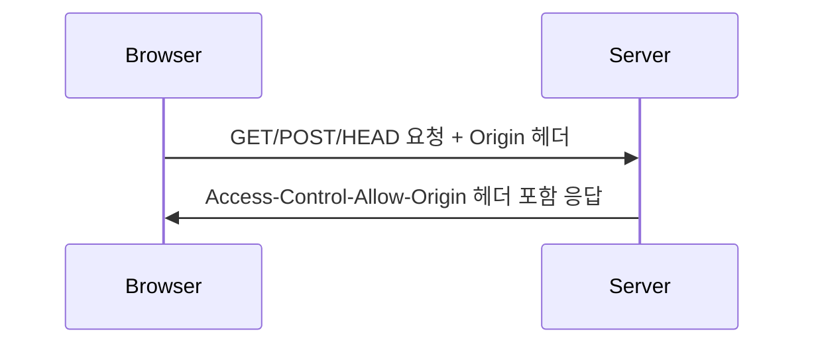
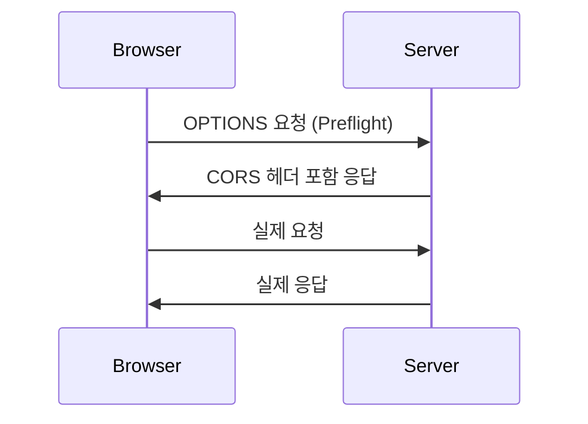

## CORS란?

CORS는 다른 출처(Origin)의 리소스를 공유할 수 있도록 설정하는 HTTP 헤더 기반의 메커니즘입니다.

### 출처(Origin)란?

출처는 다음 세 가지 요소의 조합입니다:

- 프로토콜 (http, https)
- 호스트 (domain)
- 포트 번호

```
<https://www.example.com:443/path>
└─┬──┘    └──┬─────────┘ └┬─┘
프로토콜      호스트         포트

```

## 동작 방식

### 1. 단순 요청 (Simple Request)



### 2. 프리플라이트 요청 (Preflight Request)



## CORS 에러 해결 방법

### 1. 서버 측 설정 (Express)

```tsx
// 모든 출처 허용
app.use(cors());

// 특정 출처만 허용
app.use(
  cors({
    origin: "<https://example.com>",
    methods: ["GET", "POST"],
    allowedHeaders: ["Content-Type", "Authorization"],
    credentials: true
  })
);
```

### 2. 프록시 설정 (개발 환경)

```jsx
// package.json
{
  "proxy": "<http://api.example.com>"
}

// vite.config.ts
export default defineConfig({
  server: {
    proxy: {
      '/api': {
        target: '<http://api.example.com>',
        changeOrigin: true,
        rewrite: (path) => path.replace(/^\\/api/, '')
      }
    }
  }
});

```

### 3. Nginx 설정

```
location /api {
    proxy_pass <http://backend>;
    add_header 'Access-Control-Allow-Origin' '<https://example.com>';
    add_header 'Access-Control-Allow-Methods' 'GET, POST, OPTIONS';
    add_header 'Access-Control-Allow-Headers' 'DNT,User-Agent,X-Requested-With,If-Modified-Since,Cache-Control,Content-Type,Range,Authorization';
    add_header 'Access-Control-Expose-Headers' 'Content-Length,Content-Range';
}

```

## 실제 구현 예시

### 프론트엔드 (React/Axios)

```tsx
// API 클라이언트 설정
const api = axios.create({
  baseURL: "<https://api.example.com>",
  withCredentials: true, // 쿠키 포함 요청시 필요
  headers: {
    "Content-Type": "application/json"
  }
});

// API 요청 예시
try {
  const response = await api.get("/users");
} catch (error) {
  if (error.response?.status === 403) {
    console.error("CORS 에러 발생");
  }
}
```

### 백엔드 (Node.js/Express)

```tsx
import express from "express";
import cors from "cors";

const app = express();

// CORS 미들웨어 설정
const corsOptions = {
  origin: (
    origin: string | undefined,
    callback: (error: Error | null, allow?: boolean) => void
  ) => {
    const allowedOrigins = ["<https://example.com>", "<http://localhost:3000>"];

    if (!origin || allowedOrigins.includes(origin)) {
      callback(null, true);
    } else {
      callback(new Error("Not allowed by CORS"));
    }
  },
  methods: ["GET", "POST", "PUT", "DELETE", "OPTIONS"],
  allowedHeaders: ["Content-Type", "Authorization"],
  credentials: true,
  maxAge: 86400 // Preflight 결과 캐시 시간 (24시간)
};

app.use(cors(corsOptions));
```

## 보안 고려사항

### 1. Origin 검증

```tsx
// 잘못된 예시 ❌
app.use(cors()); // 모든 출처 허용

// 좋은 예시 ✅
app.use(
  cors({
    origin: process.env.ALLOWED_ORIGINS?.split(","),
    credentials: true
  })
);
```

### 2. 인증 관련 주의사항

```tsx
// 프론트엔드
axios.defaults.withCredentials = true; // 쿠키 포함 요청시

// 백엔드
app.use(
  cors({
    credentials: true,
    origin: "<https://example.com>" // credentials: true인 경우 와일드카드(*) 사용 불가
  })
);
```

### 3. 헤더 노출 제한

```tsx
app.use(
  cors({
    exposedHeaders: ["Content-Length"] // 클라이언트에 노출할 헤더만 명시
  })
);
```

## 자주 발생하는 문제와 해결방법

### 1. Credentials 문제

```
Access to XMLHttpRequest at '<https://api.example.com>' from origin '<https://example.com>'
has been blocked by CORS policy: Response to preflight request doesn't pass
access control check: The value of the 'Access-Control-Allow-Credentials' header
in the response is '' which must be 'true' when the request's credentials mode is 'include'.

```

해결방법:

```tsx
// 프론트엔드
axios.defaults.withCredentials = true;

// 백엔드
app.use(
  cors({
    credentials: true,
    origin: "<https://example.com>"
  })
);
```

### 2. 메서드 허용 문제

```
Method PUT is not allowed by Access-Control-Allow-Methods in preflight response.

```

해결방법:

```tsx
app.use(
  cors({
    methods: ["GET", "POST", "PUT", "DELETE", "OPTIONS"]
  })
);
```

## 마무리

CORS는 웹 보안의 중요한 부분이며, 적절한 설정이 필요합니다. 개발 환경과 프로덕션 환경에서 각각 다른 전략을 사용할 수 있으며, 보안과 편의성의 균형을 잘 맞추는 것이 중요합니다.
