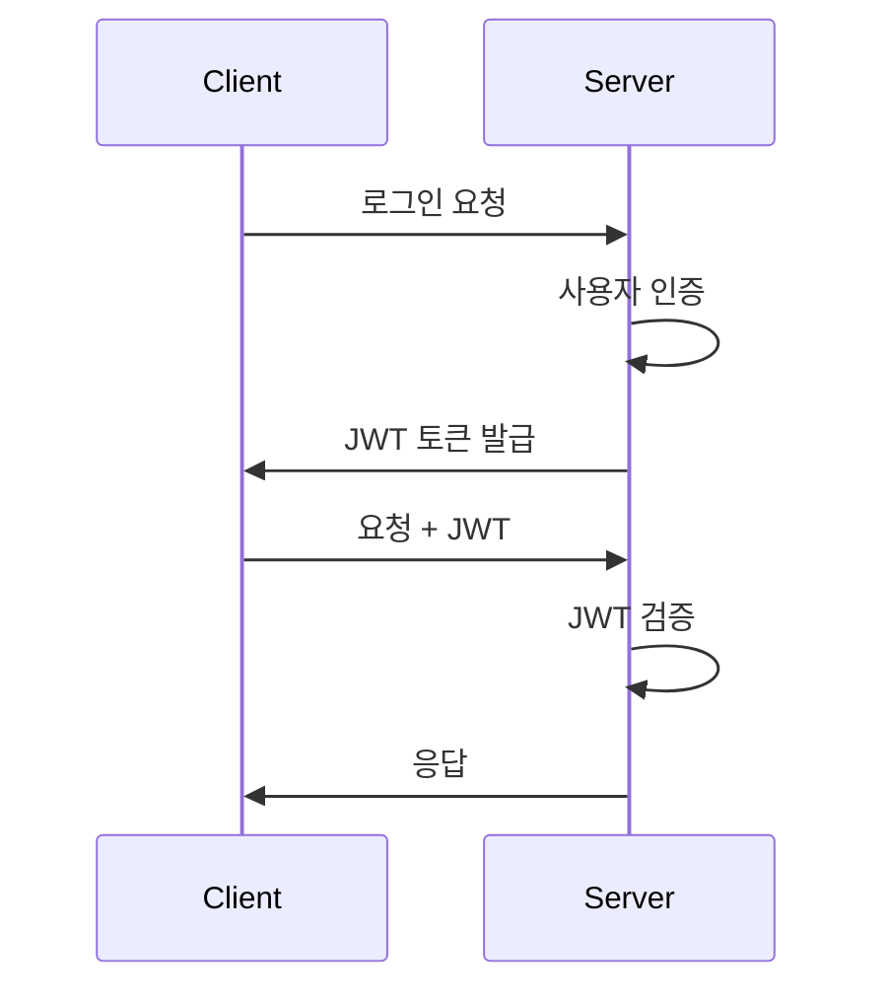

## JWT란?

JWT는 당사자 간에 정보를 JSON 객체로 안전하게 전송하기 위한 독립적인 방식을 정의하는 표준입니다. 이 정보는 디지털 서명이 되어 있으므로 신뢰할 수 있습니다.

## JWT 구조

JWT는 세 부분으로 구성되며, 각각 점(.)으로 구분됩니다:

```
xxxxx.yyyyy.zzzzz

```

1. **헤더 (Header)**

```json
{
  "alg": "HS256",
  "typ": "JWT"
}
```

1. **페이로드 (Payload)**

```json
{
  "sub": "1234567890",
  "name": "홍길동",
  "iat": 1516239022,
  "exp": 1516239022
}
```

1. **서명 (Signature)**

```jsx
HMACSHA256(base64UrlEncode(header) + "." + base64UrlEncode(payload), secret);
```

## JWT 작동 방식



## 실제 구현 예시

### 1. JWT 생성 (Node.js)

```tsx
import jwt from "jsonwebtoken";

const generateToken = (user: User) => {
  return jwt.sign(
    {
      id: user.id,
      email: user.email
    },
    process.env.JWT_SECRET!,
    { expiresIn: "1h" }
  );
};
```

### 2. JWT 검증 미들웨어

```tsx
import { Request, Response, NextFunction } from "express";
import jwt from "jsonwebtoken";

const authMiddleware = (req: Request, res: Response, next: NextFunction) => {
  try {
    const token = req.headers.authorization?.split(" ")[1];
    if (!token) {
      return res.status(401).json({ message: "인증 토큰이 없습니다." });
    }

    const decoded = jwt.verify(token, process.env.JWT_SECRET!);
    req.user = decoded;
    next();
  } catch (error) {
    return res.status(401).json({ message: "유효하지 않은 토큰입니다." });
  }
};
```

## 장단점

### 장점

1. **무상태성(Stateless)**
   - 서버에 세션 저장소가 필요 없음
   - 서버 확장이 용이
2. **확장성**
   - 다양한 디바이스와 도메인에서 사용 가능
   - Cross-Origin Resource Sharing (CORS) 문제 해결 용이
3. **자가 수용적**
   - 토큰 자체에 필요한 정보가 포함됨
   - 추가 DB 조회 최소화

### 단점

1. **토큰 크기**
   - 세션 ID에 비해 큰 크기
   - 네트워크 부하 증가 가능성
2. **보안**
   - 클라이언트에 저장되므로 XSS 공격에 취약할 수 있음
   - 토큰 탈취 시 만료 전까지 대응 어려움
3. **영구 저장소**
   - 토큰 무효화가 어려움
   - 블랙리스트 관리 필요

## 보안 강화 방법

### 1. 리프레시 토큰 사용

```tsx
interface Tokens {
  accessToken: string;
  refreshToken: string;
}

const generateTokens = (user: User): Tokens => {
  const accessToken = jwt.sign({ id: user.id }, process.env.JWT_SECRET!, {
    expiresIn: "15m"
  });

  const refreshToken = jwt.sign({ id: user.id }, process.env.REFRESH_SECRET!, {
    expiresIn: "7d"
  });

  return { accessToken, refreshToken };
};
```

### 2. 토큰 저장

```tsx
// 프론트엔드 (안전한 저장)
const storeTokens = (tokens: Tokens) => {
  // Access Token은 메모리에 저장
  setAccessToken(tokens.accessToken);

  // Refresh Token은 HttpOnly 쿠키에 저장
  document.cookie = `refreshToken=${tokens.refreshToken}; path=/; HttpOnly; Secure`;
};
```

## 모범 사례

1. **만료 시간 설정**
   - 액세스 토큰: 15분 ~ 1시간
   - 리프레시 토큰: 1주 ~ 2주
2. **페이로드 최소화**
   - 필수 정보만 포함
   - 민감한 정보 제외
3. **환경 변수 관리**

```tsx
// .env
JWT_SECRET = your - 256 - bit - secret;
REFRESH_SECRET = your - different - 256 - bit - secret;

// config.ts
export const config = {
  jwt: {
    secret: process.env.JWT_SECRET!,
    refreshSecret: process.env.REFRESH_SECRET!,
    accessExpiresIn: "15m",
    refreshExpiresIn: "7d"
  }
};
```

이러한 JWT 구현은 현대 웹 애플리케이션에서 널리 사용되는 인증 방식이며, 적절한 보안 조치와 함께 사용하면 안전하고 효율적인 인증 시스템을 구축할 수 있습니다.
